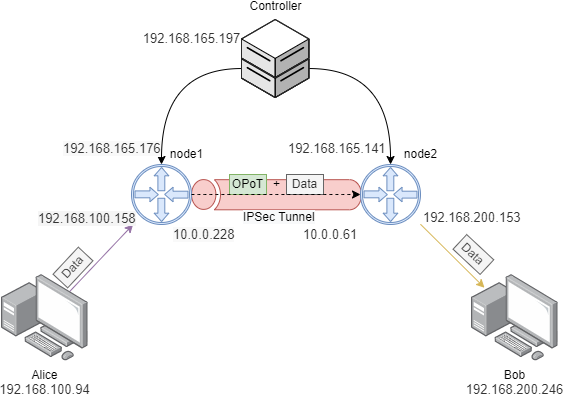

# Controller Image
Si tienes acceso a la imagen del controlador. Por defecto, al iniciar la máquina se arrancarán automáticamente los procesos del controlador del I2NSF como del PoT.
A través de una configuración como cloud-init, podemos modificar las variables de entorno usado por los controladores. 


Debajo podeis ver una plantilla de como se puede configurar el controlador. Por defecto las credenciales de la imagen son debian/debian, pero se pueden modificar a través del cloud-init. 
```yaml
#cloud-config 
password: debian 
ssh_pwauth: True
chpasswd:
  expire: false
write_files:
- path: /etc/environment
  content: |
    CONTROLLER_IP="CONTROLLER_IP"
    OPEN_API_IP="OPEN_API_IP"
    KAFKA_SERVERS="KAFKA_SERVERS"
  append: false
```
Para poder modificar las variables de entorno una vez arrancada la máquina, podeis cambiarlas directamente en `/etc/environment`. Para que surtan efecto los cambios, reiniciando los servicios o la misma máquina es suficiente.

## Restarting the services
* Para el caso del controlador I2NSF se reinicia a través del comando `sudo systemctl restart i2nsf-controller.service`.
* Para el caso del controlador del PoT, `docker-compose -f /home/debian/docker-compose.yml up -d --force-recreate`. 

# Agent Image:

Si tienes acceso a la imagen de los agentes. Por defecto, al iniciar la máquina se arrancarán automáticamente los procesos del agente del I2NSF como del PoT.
A través de una configuración como cloud-init, podemos modificar las variables de entorno usado por la máquina.

Esta es la plantilla para desplegar la imagen de los nodos. Por defecto, la imagen usa las credenciales debian/debian como el usuario principal.
```yaml
#cloud-config
password: debian
ssh_pwauth: True
chpasswd:
  expire: false
write_files:
- path: /etc/environment
  content: |
    OPOT_CONTROLLER_IP="ControllerIP"
  append: false
```
Los agentes del PoT necesitan conocer la IP del controlador, ya que será el encargado de guardar las métricas enviadas por estos.
## Restarting the services
* Para el caso del agente I2NSF se reinicia a través del comando `sudo systemctl restart i2nsf-controller.service`.
* Para el caso del nodo del PoT, `docker-compose -f /home/debian/docker-compose.yml up -d --force-recreate`.

# Example Usage

## Scenario
En este escenario hemos desplegado 5 máquinas diferentes.
* Controlador: Se encarga de las peticiones para desplegar el tunel IPSEC y los nodos del PoT. Esta máquina estará corriendo la imagen `I2NSF-PoT-Controller.qcow2`. 
* Node1 and Node2: Crearán la comunicación a través del tunel I2NSF. Ambas máquinas estarán corriendo la imagen `I2NSF-PoT-Agent.qcow2`
* Alice and Bob: Dos máquinas que quieres establecer una comunicación segura. 

También, existen 4 redes distintas:
* Management: permite la comunicación entre los nodos y el controlador.
* Controller IP: 192.168.165.197
    * Node1 IP: 192.168.165.176
    * Node2 IP: 192.168.165.141
* Data: permite la comunicación mediante el tunel IPSec entre los nodos.
    * Node1 IP: 10.0.0.228
    * Node2 IP: 10.0.0.61
* Internal1: se usa para establecer la conexión entre Alice y Node1.
    * Alice IP: 192.168.100.94
    * Node1 IP: 192.168.100.158
* Internal2: se usa para establecer la conexión entre Bob y Node2.
    * Bob IP: 192.168.200.246
    * Node2 IP: 192.168.200.153

Una cosa a tener en cuenta es que tanto Alice como Bob tienen como ruta por defecto los agentes conectados en sus respectivas redes. 

## Controller Config
Esta es la configuración de cloud-init utilizada para lanzar el controlador:
```yaml
#cloud-config
password: debian
ssh_pwauth: True
chpasswd:
  expire: false
write_files:
  - path: /etc/environment
    owner: root:root
    content: |
      CONTROLLER_IP=0.0.0.0
      OPEN_API_IP=0.0.0.0
    append: false 
```

En esta caso al no pasar la dirección de los servidores de Kafka, por defecto se desactivará.

## Nodes Config 
Esta es la configuración de cloud-init usada para lanzar los nodos:
```yaml
#cloud-config
password: debian
ssh_pwauth: True
chpasswd:
  expire: false
write_files:
  - path: /etc/environment
    owner: root:root
    content: |
      OPOT_CONTROLLER_IP=192.168.165.197
    append: false
```

## Deploying the I2NSF tunnel
Una vez que las máquinas se hayan lanzado y configurado, ya podemos desplegar el tunel I2NSF. Una manera de hacerlo es mediante el Swagger-UI 
en http://192.168.165.197:5000/ui/#/I2NSF/api.create_i2nsf, desde donde puedes ver una previsualización de como de las peticiones ya algunos ejemplos. 

Para este escenario, le vamos a pasar la siguiente información:
```json
{
  "encAlg": [
    "3des",
    "des"
  ],
  "hardLifetime": 140,
  "intAlg": [
    "hmac-sha1-160"
  ],
  "nodes": [
    {
      "ipControl": "192.168.165.176",
      "ipData": "10.0.0.228",
      "networkInternal": "192.168.100.0/24"
    },
    {
      "ipControl": "192.168.165.141",
      "ipData": "10.0.0.61",
      "networkInternal": "192.168.200.0/24"
    }
  ],
  "softLifetime": 120
}
```
También podemos desplegar dicho tunnel realizando una petición directa a la API.
```bash
curl -X 'POST' \
  'http://192.168.165.197:5000/i2nsf' \
  -H 'accept: application/json' \
  -H 'Content-Type: application/json' \
  -d '{
  "encAlg": [
    "3des",
    "des"
  ],
  "hardLifetime": 140,
  "intAlg": [
    "hmac-sha1-160"
  ],
  "nodes": [
    {
      "ipControl": "192.168.165.176",
      "ipData": "10.0.0.228",
      "networkInternal": "192.168.100.0/24"
    },
    {
      "ipControl": "192.168.165.141",
      "ipData": "10.0.0.61",
      "networkInternal": "192.168.200.0/24"
    }
  ],
  "softLifetime": 120
}'
```

En esta demostración nos ha devuelto lo siguiente:
```json
{
  "i2nsfInfo": {
    "encAlg": "3des",
    "hardLifetime": 140,
    "intAlg": "hmac-sha1-160",
    "nodes": [
      {
        "ipControl": "192.168.165.141",
        "ipData": "10.0.0.61",
        "networkInternal": "192.168.200.0/24"
      },
      {
        "ipControl": "192.168.165.176",
        "ipData": "10.0.0.228",
        "networkInternal": "192.168.100.0/24"
      }
    ],
    "softLifetime": 120
  },
  "status": "running",
  "uuid": "bd16aed2-f1f3-45e5-9d70-d7a232583781"
}
```
El uuid es importante tenerlo guardado, porque será necesario para eliminar el tunel una vez que se deje de utilizar.

## Deploy PoT Path:
El controlador del PoT también tien una API. Una manera de desplegar el PoT es a través de la Swagger-UI en http://192.168.165.197:8080/opot_api/ui/#/opot/opot_sdk, donde hau algunos ejemplos 
para cada endpoint. En este caso le pasamos la siguiente información a la API. 

```json
{
  "protocol":"UDP",
  "prometheus" : true,
  "nodes":
  [
    {"mgmt_ip":"192.168.165.176","path_ip":"192.168.100.158"},
    {"mgmt_ip":"192.168.165.141","path_ip":"192.168.200.153"}
  ],
  "sender": {"ip":"192.168.100.158"},
  "receiver": {"ip":"192.168.200.153"}
}
```
Ejecutándolo mediante curl, resultaría en el siguiente comando:

```bash
curl -X POST \
 "http://192.168.165.197:8080/opot_api/path" -H \
 "accept: application/json" -H  "Content-Type: application/json" \ 
 -d '{
    "protocol":"UDP",
    "prometheus" : true,
    "nodes": [
      {"mgmt_ip":"192.168.165.176","path_ip":"192.168.100.158"},
      {"mgmt_ip":"192.168.165.141","path_ip":"192.168.200.153"}
    ],
    "sender":{"ip":"192.168.100.158"},
    "receiver":{"ip":"192.168.200.153"}
  }'
```
En este caso el servidor ha devuelto la siguiente información.

```json
{
  "Operative": 200,
  "creation_time": 1645198644741818,
  "masks": [
    [
      15780754819687272000,
      608917023191512600
    ]
  ],
  "nodes": [
    {
      "address": {
        "mgmt_ip": "192.168.165.176",
        "path_ip": "192.168.100.158",
        "port": 30582
      },
      "node_id": "c7869427ac53e9e1f7b3925f25746bfb",
      "node_position": 1,
      "node_type": "Ingress",
      "status": "Operative"
    },
    {
      "address": {
        "mgmt_ip": "192.168.165.141",
        "path_ip": "192.168.200.153",
        "port": 38834
      },
      "node_id": "747df83ccd881eeb3756f5465ace97d6",
      "node_position": 2,
      "node_type": "Egress",
      "status": "Operative"
    }
  ],
  "path_status": "Operative",
  "pot_id": "ab8d85ba-90d0-11ec-9b6f-fa163e0d4635",
  "protocol": "UDP"
}
```
Como antes, es necesario guardar el uuid para eliminar el PoT.

## Eliminación del tunel I2NSF:
Para poder eliminar el tunel I2NSF ejecuta lo siguiente:
```bash
curl -X 'DELETE' \
  'http://192.168.165.197:5000/i2nsf/bd16aed2-f1f3-45e5-9d70-d7a232583781' \
  -H 'accept: application/json'
```
## Eliminación del PoT: 
Para poder eliminar el PoT ejecuta lo siguiente:
```bash
curl -X 'DELETE' \
 'http://192.168.165.197:8080/opot_api/path/ab8d85ba-90d0-11ec-9b6f-fa163e0d4635' \ 
 -H  'accept: application/json'
```

# Logs

## Controlador:
* Para el caso del controlador del I2NSF ejecutar:
```bash
sudo journalctl -u i2nsf-controller 
# En caso de querer verlo en "directo"
sudo journalctl -u i2nsf-controller -f
```
* Para el caso del controlador del PoT ejecutar:
```bash
sudo docker-compose logs -f -t 
```
## Agentes:
* Para el caso del agente del I2NSF ejecutar:
```bash
sudo journalctl -u supervisor
# En caso de querer verlo en "directo"
sudo journalctl -u supervisor -f
```
* Para el caso del nodo del PoT ejecutar:
```bash
sudo docker-compose logs -f -t 
```