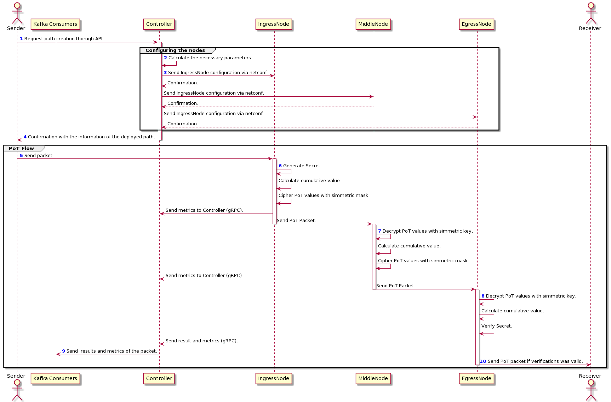
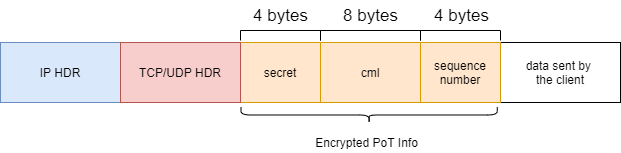

#Prototype 1

This page represents the installation guide of this prototype and how we can launch the scenario represented in [Information about the prototype](sample/prototype1/README.md).

1. [Installation Guide](#installation-guide)

2. [PoT Elements](#pot-elements)
   
   2.1. [Controller](#controller)
   
   2.2. [Node](#node)
   
[comment]: <> (3.)
   


# Installation guide.
You can find the installation guide in [here](/install/README.md).

# PoT Elements
This version of the PoT is based in this [ietf-draft](https://datatracker.ietf.org/doc/html/draft-ietf-sfc-proof-of-transit-08). 

## Controller
Each time a PoT path is going to be defined, the Controller is going to be the manager of all the necessary information, that later will be passed to the nodes.

### OpenAPI
In order to make this service  accessible, the interaction with the Controller have been developed using the OpenAPI standard. These are the possible interactions with the controller through the API:
#### Create PoT path:
The endpoint for this operation is under `/api/v2/pot/controller/path`. There you need to pass a json format with the following structure:
```json
{
  "nodes": [
    {
      "ip": "Address of the first node"
    },
    {
      "ip": "Address of the second node"
    },
    {
      "ip": "Address of the third node"
    }
  ],
  "protocol": "Protocol to use [TCP/UDP]",
  "receiver": {
    "ip": "Address of machine that is going to receive the PoT packet",
    "port": "Port where the receiver will be listening for the Egress Node packets."
  },
  "sender": {
    "ip": "Address of the machine that is going to send packets to the ingress Node.",
    "port": "Port where the Ingress Node should be listening to the sender packets."
  }
}
```
A few things to consider with this format:
* The order of the nodes defined in the JSON will be the same order as the nodes in the path.
* Since its running prometheus, you can enable it for a specific path, by adding the variable `"test" : true` inside the json.

If the path is correctly deployed, it will return with a json format the following information:
```json
{
  "pot_id ": "1266841a-0650-4496-a5ad-e84a5ae762f3",
  "status": 200,
  "path_status": "Operative",
  "nodes": [
    {
      "status": "Operative",
      "node_id": "Ingress_node_id",
      "node_position": 0,
      "address": {
        "ip": "192.168.0.1",
        "port": 55432
      },
      "node_type": "Ingress"
    },
    {
      "status": "Operative",
      "node_id": "Egress_node_id",
      "node_position": 1,
      "address": {
        "ip": "192.168.0.2",
        "port": 55433
      },
      "node_type": "Egress"
    }
  ],
  "masks": [
    "2xaH0dBnJBRGQDXl8bhRXLqm81cVV7ddNJDrp77uvbs="
  ],
  "protocol": "UDP",
  "creation_time": 1615305214342100
}
```
#### Get information about a path:
You can also check the current information of a path using the endpoint `/api/v2/pot/controller/path/{uuid}`. There, it will return the same information as the one of the create endpoint when the path has been correctly deployed.

#### Delete a path: 
When a path is no longer useful, you can delete it by using the endpoint `/api/v2/pot/controller/path/{uuid}`.

You can check for more examples and other type of responses by checking the webpage [Swagger Editor](https://editor.swagger.io/) where you need to upload the [openapi.vi.yaml](openapi/reference/openapi.v1.yaml) file.

## Nodes
The nodes are configured via the Controller using Netconf and the [ietf-pot-profile.yang](./install/yang/ietf-pot-profile.yang) format. Then, the metrics are sent back to the controller by using gRPC. The format of those metrics are defined under [log.proto](opot_sdk/config/logging/log.proto).


# KAFKA:
Read this [section](install/README.md) in order to enable the kafka producer. 
Once it is configured, the values that will be passed to the kafka consumer have the following format:
```json
{
  "pot_id": "",
  "packet_number": "number of packet",
  "nodes": [
    "node_id_1",
    "node_id_2",
    "node_id_3"
  ],
  "timestamps": [
    1615305214342100,
    1615305214362110,
    1615305214402120
  ],
  "valid": "[true|false]"
}
```
## Prometheus:
In order to take metrics of the packets crossing a path, you need to pass the variable `test`, when creating the path as it is defined in [Create a path](#create-pot-path). This are the metrics taken when a path is deployed:
* **valid_verification**: Time spent to verify that the OPoT validation has been successful.
* **invalid_verification**: Time spent to verify that the OPoT validation has been unsuccessful.
* **create_time**: Time spent by the controller, and the nodes to instantiate an OPoT Path.

## gRPC
The protocol gRPC is used to send the metrics between the nodes and the controller, which are going to be used to check where did the error ocurr when the verification in the EgressNode was invalid and to then send those metrics to the Kafka Consumer and Prometheus.

### IngressNode --> Controller
```
message IngressLog {
  string path_id = 1;
  string node_id = 2;
  int32 sequence_number = 3;
  int64 cml = 4;
  int32 secret = 5;
  int64 timestamp = 6;
}
```
### MiddleNode --> Controller
```
message MiddleLog {
  string path_id = 1;
  string node_id = 2;
  int32 sequence_number = 3;
  int64 cml = 4;
  int64 timestamp = 5;
}
```
### EgressNode --> Controller
```
message EgressLog {
  string path_id = 1;
  string node_id = 2;
  int32 sequence_number = 3;
  int64 cml = 4;
  bool valid = 5;
  int64 timestamp = 6;
}
```
### gRPC services defined 
```
service LogReport {
  rpc ingressToController(IngressLog) returns (Empty) {};
  rpc middleToController(MiddleLog) returns (Empty) {};
  rpc egressToController(EgressLog) returns (Empty) {};
}
```
## Diagram of the deployment and a packet crossing the path.



1. In the first step of this diagram, the client want to setup a PoT path between three nodes. So, the client must send a POST HTTP message to the endpoint `http://opot_controller:8080/api/v2/pot/controller/path` with the format defined in [Create PoT path](create-pot-path). 
2. During this step, the controller must calculate the necessary lagrange parameters for the SSS, the ids of the nodes, set an id for the controller and generates the symmetric masks that are going to be used between the nodes.
3. Once the controller has the values to configure the nodes, he starts configuring the first node in the path via Netconf using the structure defined ietf-pot-profile yang model (The one used in this project has a few changes). When the first node confirms that the configuration is valid, it continues with the following node.
4. When all the nodes have been correctly configured, the controller will return a message with status code `200`, and the json data defined in [Create a path](#create-pot-path).
5. The path is now defined and ready to start receiving packages. So, the client (which is the sender), send the first packet to the IngressNode, using the port and protocol defined in the json used to create the path. 
6. When the IngressNode receives the packet from the sender, he first creates a secret which is a random value between 0, and the primer number defined by the controller when he calculated the SSS values. Then it calculates the CML value and set a sequence number to follow the packet. This sequence number is then used by the controller to identify later the metrics sent by the different nodes.
   
   
With the PoT values ready, the IngressNode use the symmetric mask between the IngressNode, and the MiddleNode to cipher the PoT values which correspond to the Secret, the CML and the sequence number. Then it generates the PoT packet which has the following format.
   

Finally, the IngressNode sends the packet to the MiddleNode and sends the following metrics back to the controller using the gRPC protocol like it was explained in [gRPC](grpc).

7. The MiddleNode receives the packet from the IngressNode. First, he needs to decrypt the PoT values, with the symmetric mask (IngressNode-MiddleNode).
With the PoT values, he calculates the new CML, and then it follows the same process as the IngressNode by ciphering those values with symmetric key (MiddleNode-EgressNode) and creating the PoT packet.
Finally, he sends the packet to the EgressNode, and the following metrics defined in [gRPC](grpc).
8. Like step 7 the EgressNode must decrypt the PoT values using the symmetric key (MiddleNode-EgressNode) and calculate the new CML value.
   Then, he needs to verify that the packet has crossed the nodes with the specific order, so with the new CML value it verifies that:
[!equation](http://www.sciweavers.org/tex2img.php?eq=CML_i+%5C+mod%28p%29+%3D%3D+RND&bc=White&fc=Black&im=jpg&fs=12&ff=arev&edit=)
   After the verification it sends the results to the controller with the metrics defined in [gRPC](grpc).
9. When the controller receives the metrics from the EgressNode and check if the result of the validations was incorrect, it calculates where did the error occur, and then, it sends the results to the Kafka consumer with the format defined in [Kakfa](kafka).
10. If the verification has been successful, then the EgressNode send the data from the client(sender) to the receiver. 

