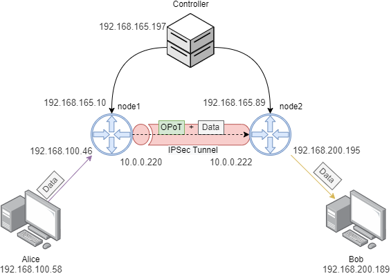

# Table of contents

- [I2NSF](#i2nsf-installation)
- [OPoT](#opot-installation)
    - [Controller](#controller-installation)
    - [Node](#node-installation)

# I2NSF Installation


# OPoT  Installation
First in both cases you need clone the repository which contains the code and the Docker file to build either the controller or the node.

```bash
git clone --single-branch --branch libyang1 dev https://github.com/Telefonica/cne-opot_sdk
```

Also in order to build the image you need to install docker in the machine following the [offical guide](https://docs.docker.com/engine/install/ubuntu/).

## Controller Installation:

To build the controller, under the repository folder execute the following:
```bash
sudo docker build -t opot_controller . --build-arg type=controller
```

This will tell docker to build the controller image with the tag `opot_controller`.

### Configuration

The recommendation to run the controller image is to setup a docker-compose file with the following details.

```yaml
version: "3.9"
services:
  controller:
    image: opot_controller
    network_mode: host
    environment:
      - OPOT_CONTROLLER_IP=controller_ip
      - OPEN_API_IP=openapi_ip
      - KAFKA_SERVERS=kafka_ip:9092
      - KAFKA_TOPIC=pot_stats
      - NETCONF_SSH_PORT=8300
    network_mode: host
```

You can adjust different settings and different environment variables based in what has been described in [here](./install/README.md). 

Also you could add directly the `controller_config.ini` by adding a volume instead of setting the environment variables in the `docker-compose.yaml` file. You will need to define the config for example under `/opt/controller_config.ini`, with the following values:
```ini
[CONTROLLER]
OPOT_CONTROLLER_IP=0.0.0.0
NETCONF_SSH_PORT=8300
[OPENAPI]
OPEN_API_IP=0.0.0.0
[KAFKA]
KAFKA_SERVERS=kafka_ip:9092
KAFKA_TOPIC=pot_stats
```
And then set the volumen:
```yaml
version: "3.9"
services:
  controller:
    image: opot_controller
    network_mode: host
    volumes:
      - /opt/controller_config.ini:/etc/default/controller_config.ini
```

### Running

By running  `sudo docker-compose up -d`, will start the controller in the background. To see the logs generated by the container run `sudo docker-compose logs -f -t`.

## Node Installation:

In order to install the Node, first build the docker image under the folder repository:
```bash
sudo docker build -t opot_node . --build-arg type=node
```

This will create the node image with tag `opot_node`.


### Configuration

Like with the controller, you can setup a `docker-compose.yaml` file to run the `opot_node` image. 
```yaml
version: "3.9"
services:
  node:
    image: opot_node
    environment:
      - NETCONF_PORT=8300
      - OPOT_CONTROLLER_IP=192.168.165.197
      - LOGS_PATH=/tmp
    network_mode: host
    cap_add:
      - ALL
```

As before the environment variables are defined in [here](./install/README.md). Also, instead of defining the configuration of the node through the docker-compose you can set the via the `node_config.ini` file, like the example below:
```ini
[NODE]
OPOT_CONTROLLER_IP=192.168.165.197
LOGS_PATH=/tmp
```

So the compose file should look like:
```yaml
version: "3.9"
services:
  node:
    image: opot_node
    network_mode: host
    environment:
      - NETCONF_PORT=8300
    volumes:
      - /opt/node_config.ini:/etc/default/node_config.ini
    network_mode: host
    cap_add:
      - ALL
```

### Running

By running  `sudo docker-compose up -d`, will start the controller in the background. To see the logs generated by the container run `sudo docker-compose logs -f -t`.


# Example 

## Scenario description
In this scenario it has been deployed 5 different machines. 

* Controller: Will manage the requests to deploy the IPSec tunnel and the OPoT nodes.
* Node1 and Node2: Create the communication between Alice and Bob.
* Alice and Bob: Two computers that want to establish a secure communication.

Also, there are 4 different networks:
* Management: enables the communication between the nodes and the controller
    * Controller IP: 192.168.165.197
    * Node1 IP: 192.168.165.101
    * Node2 IP: 192.168.165.133
* Data: here both nodes will establish the IPSec tunnel
    * Node1 IP: 10.0.0.161
    * Node2 IP: 10.0.0.61
* Internal1: used to establish the connection between Alice and Node1
    * Alice IP: 192.168.100.137
    * Node1 IP: 192.168.100.46
* Internal2: used to establish the connection between Bob and Node2
    * Bob IP: 192.168.200.189
    * Node2 IP: 192.168.200.153

## Cleaning Previous states:
First we need to make sure that we are launching the different services from 0. So first we need to stop the services in the controller and the nodes. You can skip these steps, if it is the first time setting the scenario.
### Controller:
First stop the OPoT controller via docker
```bash
sudo docker-compose down
# or you can stop the docker service
sudo systemctl stop docker
```
Then stop the IPSec controller.
```bash
sudo systemctl stop i2nsf-controller
```
### Nodes:
As before, first stop the containers via docker
```
sudo docker-compose down
# or you can stop the docker service
sudo systemctl stop docker
```
Then stop the supervisor service
```
sudo systemctl stop supervisor.service
# If you want to restart just the service and remove previous policies run
sudo bash /home/debian/i2nsf-server/restart.sh
```
## Configuring the scenario:
Before starting all the services, first we need to configure them.
### Controller:
In this case, we only edited the `docker-compose.yml` with the following values:
```yaml
version: "3.9"
services:
  controller:
    restart: always
    network_mode: host
    image: opot_controller
    environment:
      - OPOT_CONTROLLER_IP=192.168.165.197
      - OPEN_API_IP=192.168.165.197
      - NETCONF_SSH_PORT=8300
    network_mode: host
    volumes:
      - ./cne-opot_sdk/:/cne-opot_sdk
```
This will launch the OPoT Controller without kafka support. If you want to enable Kafka you will need to specify the kafka servers thought the docker-compose file. For example like  
```yaml
version: "3.9"
services:
  controller:
    network_mode: host
    image: opot_controller
    environment:
      - OPOT_CONTROLLER_IP=0.0.0.0
      - OPEN_API_IP=0.0.0.0
      - KAFKA_SERVERS=kafka:9092
      - KAFKA_TOPIC=pot_stats
      - NETCONF_SSH_PORT=8300
    command:
      - "bash"
      - "/entrypoint.sh"
    network_mode: host
    restart: always
    volumes:
      - ./cne-opot_sdk/:/cne-opot_sdk
```


### Nodes:
We need to define the `docker-compose.yml` file for each of the nodes:
* Node1 and Node2:
```yaml
version: "3.9"
services:
  node:
    image: opot_node
    environment:
      - NETCONF_PORT=8300
      - OPOT_CONTROLLER_IP=192.168.165.197
      - LOGS_PATH=/tmp
    network_mode: host
    cap_add:
      - ALL
```

If you have access to the qcow2 image of the Node, you can configure the nodes by modifying the `/etc/environment` through a `cloud-config` file like this
```config
#cloud-config
password: debian
ssh_pwauth: True
chpasswd:
  expire: false
write_files:
- path: /etc/environment
  content: |
    OPOT_CONTROLLER_IP="192.168.165.197"
  append: true
```
Or you can only modify the docker-compose file under the directory `/debian/docker-compose.yml`. 

## Running the scenario:

### Controller
First run the OPoT controller, starting the containers with the command `sudo docker-compose up -d`. Then go to the directory `controller` and run the I2NSF controller `systemctl start i2nsf-controller`.
This two commands will enable all the functionalities of both the I2NSF controller and the OPoT controller.

If you are running the qcow2 image, both services start on boot, so you don't need to start the process. 
### Nodes:

First start de OPoT nodes, by running the containers  `sudo docker-compose up -d`. Then you need to start the supervisor service with `sudo systemctl start supervisor.service`, which actually will set the IPSec link between the two nodes. 


### Creating the IPSEC tunnel:
In order to create a tunnel between these two gateways 
```bash
curl -X 'POST' \
  'http://192.168.165.197:5000/i2nsf' \
  -H 'accept: application/json' \
  -H 'Content-Type: application/json' \
  -d '{
  "encAlg": [
    "des"
  ],
  "hardLifetime": 140,
  "intAlg": [
    "hmac-sha1-160"
  ],
  "nodes": [
    {
      "ipControl": "192.168.165.101",
      "ipData": "10.0.0.161",
      "networkInternal": "192.168.100.0/24"
    },
    {
      "ipControl": "192.168.165.141",
      "ipData": "10.0.0.61",
      "networkInternal": "192.168.200.0/24"
    }
  ],
  "softLifetime": 120
}'
```

### Creating the OPoT Path:

To initialize and deploy de OPoT path between both nodes, you will need to specify the controller the nodes and which will be de the sender and receiver of the data. You can find more info about this in here, but for this case just execute this command:
```bash
curl -X POST "http://192.168.165.197:8080/opot_api/pot/controller/path" -H  "accept: application/json" -H  "Content-Type: application/json" -d "
    {
        \"protocol\":\"UDP\",
        \"nodes\":
            [
                {\"mgmt_ip\":\"192.168.165.101\",\"path_ip\":\"192.168.100.137\"}
                {\"mgmt_ip\":\"192.168.165.141\",\"path_ip\":\"192.168.200.153\"}
            ],
        \"sender\":{\"ip\":\"192.168.100.94\",\"port\":55555},
        \"receiver\":{\"ip\":\"192.168.200.246\",\"port\":55556}
    }"
```

From the above command, we are specifying that **Alice** is using a UDP connection, and in order to use the IPSec + OPoT setup, she must send the packets to the port *55555* of **Node1**, which then will be sent to **Node2** via the IPSec tunnel, and later received by **Bob** which is listening at port *55556*. 


