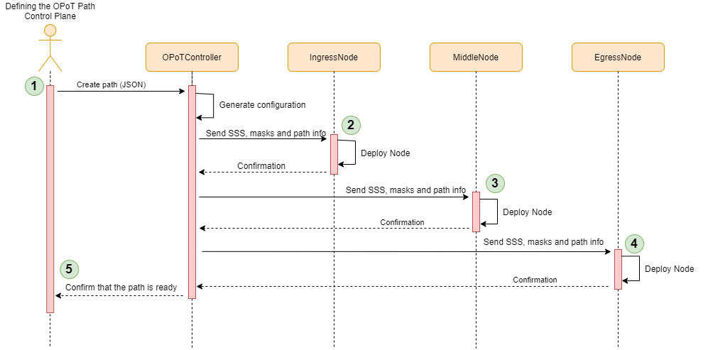
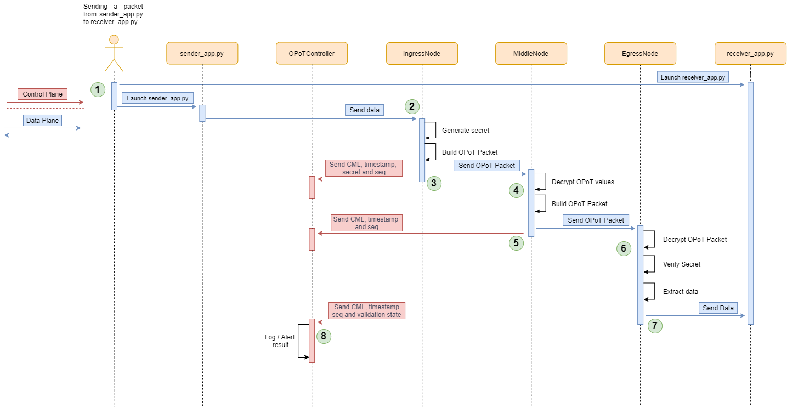

# Information about the prototype
1. [Scenario that will be deployed](#scenario-that-will-be-deployed)
2. [How the path is deployed](#how-the-path-is-deployed-control-plane)
    1. [JSON used to define the OPoT Path](#json-used-to-define-the-opot-path)
    2. [create_node command examples](#create_node-command-examples)
3. [How the packets cross the path](#how-the-path-is-deployed-control-plane)  
4. [OPoT Packets](#opot-packets)
# Scenario that will be deployed 


# How the path is deployed (Control Plane)

To reproduce this scenario it is important to mention that the `NodeController` process must be running in all the nodes before the `OPoTController` is executed. Otherwise, the packets sent by the controller won't be processes, and the scenario won't be created. 



1. First it is requested the creation of a OPoT Path. For this prototype, when the instance of the `OPoTController` is created the path will be directly parse from a JSON file.
2. Once the file is parsed, and the controller has stored all the configurations, it sends a `create_node` command to the first node, which will be received by the instance of the `NodeController`. In this case, the information sent with the command will be used to instantiate a `IngressNode`. Once the node is created, it will send a confirmation message to the controller.
3. The controller sends a `create_node` command to the second node with the information to instantiate a `MiddleNode`. If nothing has gone wrong, and the node has been correctly created, it will send an update packet telling the controller that the node is operative.
4. A last `create_node` command is sent to the last node which will create a `EgressNode`. As before, an update command will be sent to the controller confirming that the node has been correctly deployed.
5. Finally, once all the nodes have been correctly deployed (the controller must wait for the confirming message), the controller will print through the console that the OPoT Path has been deployed and is ready for the incoming packet of the receiver. 

It is important to comment that for steps 2, 3 and 4 the controller won't be waiting for the confirmation of the packets in the same thread. This means, that while it is sending the `create_command` it is also waiting in another thread to the confirmations. 

## JSON used to define the OPoT Path.

```json
{
  "protocol": "UDP",
  "nodes": [
    {
      "ip": "10.0.0.1"
    },
    {
      "ip": "10.0.0.2"
    },
    {
      "ip": "10.0.0.3"
    }
  ],
  "sender": {
    "ip": "10.0.0.32",
    "port": 55000
  },
  "receiver": {
    "ip": "10.0.0.25",
    "port": 9898
  }
}
```

### Some considerations

- We can add or remove the number of nodes. The minimum number of nodes needed is 2.
- We can force the listening port in all the nodes except the first one of the list by adding the parameter `"port" : number_of_the_port`.
- The protocols accepted are `"UDP"` or `"TCP"`

## create_node command examples 

1. Create IngressNode

    ```json
    {
      "command": "create_node",
      "info": {
        "opot_id": "cee3d07e7b4a11eba69602420a000007",
        "protocol": "UDP",
        "node_info": {
          "node_id": 0,
          "node_type": "ingress",
          "address": {
            "ip": "10.0.0.1",
            "port": 55000
          },
          "lagrange_data": {
            "y_point": 20074,
            "LPC": 18063,
            "prime": 35533
          },
          "masks": {
            "next": "0DOFAhyu+3JjplvMToO/s8uqfQpUqR5UExRc2lhDQAM="
          }
        },
        "next_info": {
          "node_id": 1,
          "node_type": "middle",
          "address": {
            "ip": "10.0.0.2",
            "port": 61434
          }
        },
        "sender_info": {
          "ip": "10.0.0.32",
          "port": 55000
        }
      }
    }
    ```

    Notice that there is not information about the previous node since this is the first node in the path. However, we will have the `sender_info` telling the ingress node which is the sender and from which port he must be listening to the incoming packets.
2. Create MiddleNode

    ```json
    {
      "command": "create_node",
      "info": {
        "opot_id": "cee3d07e7b4a11eba69602420a000007",
        "protocol": "UDP",
        "node_info": {
          "node_id": 1,
          "node_type": "middle",
          "address": {
            "ip": "10.0.0.2",
            "port": 61434
          },
          "lagrange_data": {
            "y_point": 20271,
            "LPC": 15347,
            "prime": 35533
          },
          "masks": {
            "prev": "0DOFAhyu+3JjplvMToO/s8uqfQpUqR5UExRc2lhDQAM=",
            "next": "0Fcq/TmB0OIReoduhsJpB5c8NEWOCYV/AE21DvytTgM="
          }
        },
        "prev_info": {
          "node_id": 0,
          "node_type": "ingress",
          "address": {
            "ip": "10.0.0.1",
            "port": 55000
          }
        },
        "next_info": {
          "node_id": 2,
          "node_type": "egress",
          "address": {
            "ip": "10.0.0.3",
            "port": 51060
          }
        }
      }
    }
    ```

    Notice that now we have the values of `prev_node` and `next_node` since this node is situated between two nodes. 

3. Create EgressNode

    ```json
    {
      "command": "create_node",
      "info": {
        "opot_id": "cee3d07e7b4a11eba69602420a000007",
        "protocol": "UDP",
        "node_info": {
          "node_id": 2,
          "node_type": "egress",
          "address": {
            "ip": "10.0.0.3",
            "port": 51060
          },
          "lagrange_data": {
            "y_point": 16115,
            "LPC": 2124,
            "prime": 35533
          },
          "masks": {
            "prev": "0Fcq/TmB0OIReoduhsJpB5c8NEWOCYV/AE21DvytTgM="
          }
        },
        "prev_info": {
          "node_id": 1,
          "node_type": "middle",
          "address": {
            "ip": "10.0.0.2",
            "port": 61434
          }
        },
        "receiver_info": {
          "ip": "10.0.0.25",
          "port": 9898
        }
      }
    }
    ```

    Notice that now we only have information about the previous node. But now, we have the values of `receiver_info` with the destination address and port of the receiver. 

# How the packets cross the path (Control Plane and Data Plane)



1. To reproduce this scenario, once the OPoT Path has been deployed we need to run first the receiver and then the sender. Once the sender is executed, it creates a TCP or UDP packet (depending on what has been defined in the `path.json`.  This packet will contain a JSON formatted data with a list of timestamps, where the sender has appended the first timestamp.
2. Then the `IngressNode` receives the packet sent by the sender. For each packet received it generates a  and calculates a new cumulative value (). Then it encrypts the OPoT information and appends to the JSON sent by the sender a timestamp. For each packet received, it increases a sequence number that is also appended to the JSON data. This is needed to keep track of each of the packets sent by the sender. 
3. Once the packet is prepared the node sends it to the next node in this case a `MiddleNode`. Then it sends  an `update_flow` packet to the `OPoTController`, where in this case it sends the calculated  , the  value, the sequence number, and the timestamp from when the packet was received.
4. The `MiddleNode` receives the OPoT packet and decrypts the OPoT values it using the mask associated with the `IngressNode`. With the decrypted values it calculates the new cumulative value and append the timestamp from when the package was received to the JSON data.
5. When the OPoT values have been encrypted using the associated mask, the packet is sent to the `EgressNode` and update is sent to the `OpotController` with   the sequence number and the timestamp.
6. As the `MiddleNode`, when the `EgressNode` receives the packet it decrypts the OPoT values using the associated mask of the previous node, and it calculates the new cumulative value. Then it verifies the condition . 
7. If the condition is satisfied, this means that the OPoT process has been successful, and the data of the packet can be forwarded to the receiver, but before it appends the timestamp from when the packet was received. Otherwise, it won't be forwarded. Also, as the previous nodes and update packet will be sent to the `OPoTController` with the timestamp, the  value and the state of the validation.
8. Finally, when the `OPoTController` receives the final update packet, it checks if the validation was successful or not. In the case where the OPoT process has failed, it must check where did the error occur using the values that have been sent by the different nodes.

# OPoT Packets 


Each OPoT Packet  (exchange between the nodes) will be encapsulated inside the data payload of a UDP or TCP packet. They will be composed by:

- 4 bytes for the "master secret" generated in the IngressNode
- 8 bytes for the CML value

The rest is going to be the data sent by the sender. For this test we have decided to generate a timestamp in the sender and each of the nodes is going to append a timestamp once they received a packet.